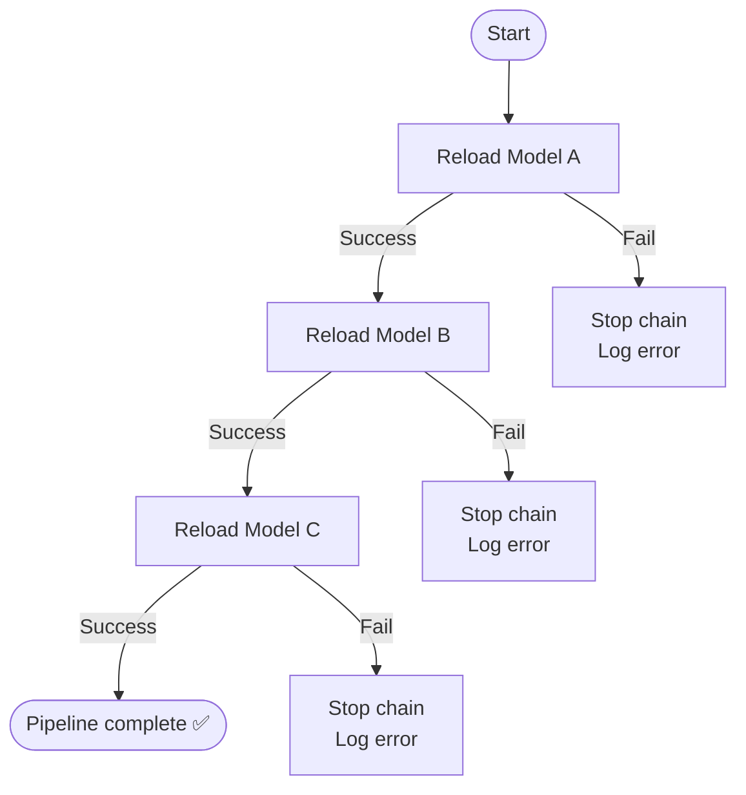

# QlikView ETL Reload Chain

A Python script that reloads three QlikView models (**A → B → C**) in strict sequence.
If any model fails, the chain stops immediately — later models never run.

---

## How it works (simple version)

```
   START
     │
     ▼
 ┌─────────┐   fails   ┌───────────────┐
 │ Reload A │ ────────▶ │ STOP + log error │
 └─────────┘           └───────────────┘
     │ succeeds
     ▼
 ┌─────────┐   fails   ┌───────────────┐
 │ Reload B │ ────────▶ │ STOP + log error │
 └─────────┘           └───────────────┘
     │ succeeds
     ▼
 ┌─────────┐   fails   ┌───────────────┐
 │ Reload C │ ────────▶ │ STOP + log error │
 └─────────┘           └───────────────┘
     │ succeeds
     ▼
   DONE ✅
```

**Rule in plain English:** each model only runs if the one before it succeeded.
The moment something fails, the script stops and writes the reason to a log file — nothing further runs.

---

## Mermaid version (renders on GitHub / most Markdown viewers)



---

## Requirements

- Windows machine with QlikView Desktop installed
- Python 3.8+
- QlikView must be set to **close automatically on script errors**, not pause:
  `Tools > User Preferences > General > Script Error > Close on Error`
  (Without this, a failed reload can hang forever waiting on a dialog box.)

---

## Configuration

Edit the top of `etl_chain.py`:

| Setting | What it does |
|---|---|
| `QV_PATH` | Path to `qv.exe` |
| `MODELS` | List of `(path, name)` pairs, in the order they should run |
| `LOG_FILE` | Where the log file is saved (anchored next to the script) |
| `TIMEOUT_SECONDS` | Max time to wait for one model before giving up |

---

## Usage

```bash
python etl_chain.py
```

- Progress and errors print to the console **and** get written to `etl_chain.log`
- Exit code `0` = full success; non-zero = something failed and the chain stopped

---

---

## Notes / Gotchas

- **Timeout ≠ error detection.** If a reload hangs on an interactive error dialog, the script waits the full `TIMEOUT_SECONDS` before giving up. Set "Close on Error" in QlikView to avoid this.
- **Adding a 4th model** is a one-line change — just add another `(path, name)` tuple to `MODELS`.
- **Scheduling:** Run this via Windows Task Scheduler (Action = `python.exe`, Arguments = path to script). Set the *"Start in"* field to the script's folder so relative behavior stays predictable, even though `LOG_FILE` no longer depends on it.

## Role of each model in the chain

- **Model A (Extracter)** — the only stage with a direct SQL database connection. It pulls from SQL and typically writes out QVD files for downstream use.
- **Models B & C (Apps)** — these don't touch SQL at all. Their `LOAD` scripts read from the QVD(s) A produced (e.g. `LOAD ... FROM *.qvd`) and apply their own transformation/join logic on top.

This matters for troubleshooting, because each stage fails in a different way:

| Stage | Likely failure causes |
|---|---|
| A (Extracter) | SQL connection timeout, auth failure, server unreachable, bad query |
| B / C (Apps) | Missing or stale QVD file, schema drift (a field renamed/dropped upstream), broken `LOAD`/join/mapping logic |

So if A fails, check its QlikView log for a SQL/connection error (see below).
If B or C fails, the SQL log tail won't show anything useful — look instead for a QVD path issue or a script logic error in that app's own log.

## NB: Make sure the connection of the extract application is working properly

